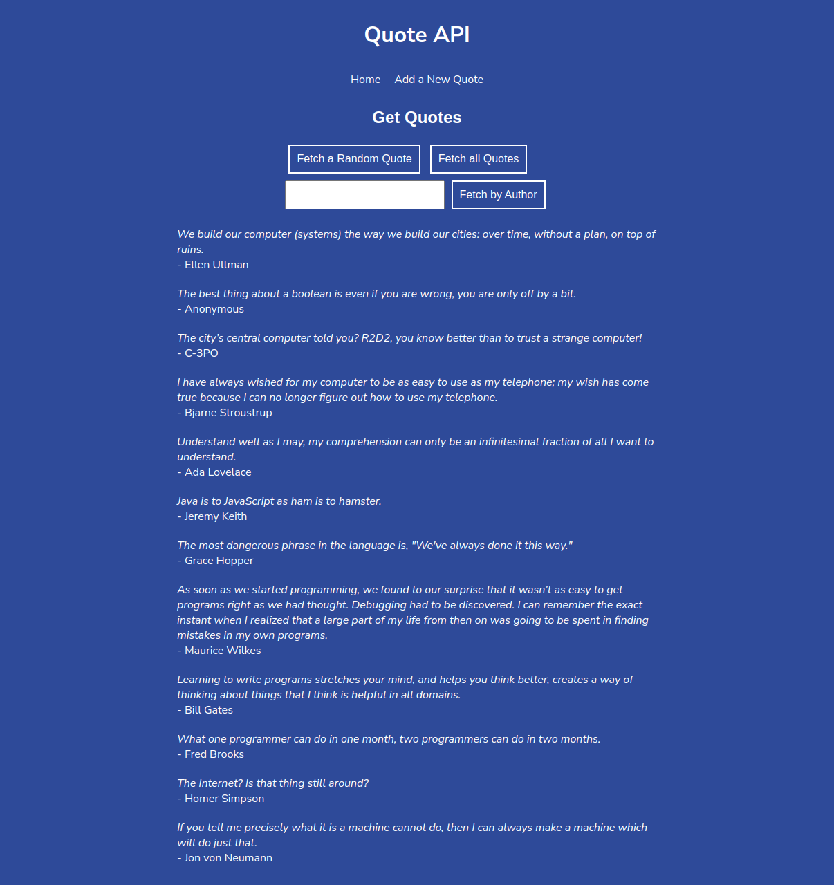

# Quote API
# Authors: Abdihakim Muhumed, Codecademy.
This is a website to serve some random quotes about technology and computers and their authors. I developed the endpoints for this website while practising Express JS routes. The frontend is courtecy of Codecademy.

# Set up instructions:
1. Run `git clone https://github.com/Abdihakim-Muhumed/Quote-API.git` to clone this repository.

2. Run `npm install ` to install required packages

3. Run `node serve.js` to start the server.

4. Open http://localhost:4001/index.html to view site.
# Technologies
 1. Javascript
 2. Node Js
 3. Express Js
 4. HTML
 5. CSS
 # Contact:

 Email: abdihakim.muhumedo@gmail.com 
 Phone: +254759430440

 # Copyright (c) 2023 Abdihakim-Muhumed